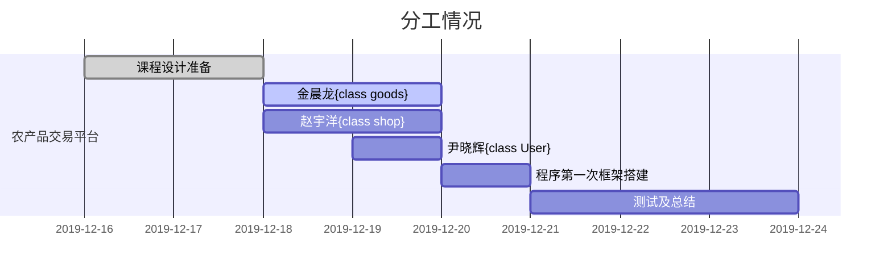

# 2019_Course_Design_Agricultural_products
## 课程设计作业

### 主题为农产品的销售平台

- 功能实现之后补充

- [x] 初步的框架

```mermaid
  gantt         
         dateFormat  YYYY-MM-DD   
         title 分工情况
         section 农产品交易平台
         课程设计准备           :done,    des1, 2019-12-16,2019-12-18
         金晨龙{class goods}             :active,  des2, 2019-12-18, 2d
         赵宇洋{class shop}             :                des2,2019-12-18,2d
         尹晓辉{class User}            :                des2,2019-12-19,1d
         程序第一次框架搭建              :         des3, after des2, 1d
         测试及总结              :         des4, after des3, 3d
```

