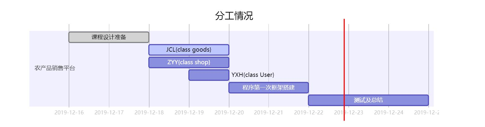

# 2019_Course_Design_Agricultural_Products
## 课程设计作业

### 主题为农产品的销售平台

#### 目标

- 实现卖家和买家在平台上销售商品

- 买家可以搜索商品、店铺的方式找到自己想要的产品并下单

- 卖家可以管理自己卖的商品

- 账户的管理，对于买卖双方的收入支出进行统计，账户金额的变动

- 优惠活动（优惠券或者打折）

#### 进度

- [x] 初步的框架
- [x] 商店类初步
- [x] 商品类初步
- [x] 买家类
- [x] 使用者类
- [x] 界面
- [ ] 待定

#### 成员进度

### UML image

